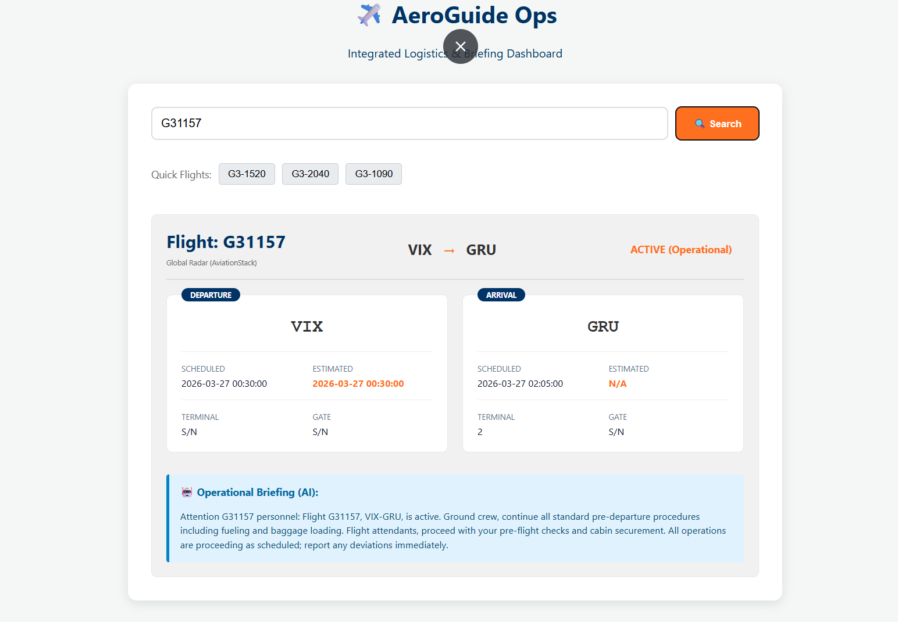

# ✈️ AeroGuide Ops - Painel Integrado de Logística e Briefing

Uma aplicação Full-Stack desenvolvida para logística de aviação, combinando banco de dados de malha interna, consumo de API de radar global em tempo real e Inteligência Artificial Generativa para criar briefings operacionais automatizados.

## 🎯 Objetivo do Projeto

Este sistema atua como um **Despachante Operacional Inteligente**. Quando um número de voo é pesquisado, o sistema:

1. **Verifica a Malha Interna:** Consulta um banco de dados local SQLite (simulando a malha da companhia).
2. **Radar Global Integrado:** Se o voo não for interno, busca dados reais em tempo real via API externa (AviationStack).
3. **Briefing com IA:** Utiliza a Inteligência Artificial do Google Gemini para atuar como um despachante, gerando instruções técnicas automatizadas para a equipe de solo e comissários com base no status exato da aeronave.
4. **Mapa Logístico:** Renderiza um mapa interativo desenhando a rota operacional de planejamento entre os aeroportos de origem e destino.

## 🛠️ Tecnologias Utilizadas

**Front-end (Interface)

- **React (Vite):** Construção rápida e moderna de interfaces baseadas em componentes.
- **React-Leaflet:** Integração de mapas interativos para planejamento de rotas.
- **Luxon:** Formatação avançada de datas e fusos horários para operações.
- **CSS3:** Estilização customizada com foco em usabilidade corporativa (UI/UX).

**Back-end (API e Regras de Negócio)

- **Python & FastAPI:** Criação de API assíncrona de alta performance.
- **SQLite:** Banco de dados relacional leve e integrado.
- **Google Gemini 2.5 Flash:** IA Generativa aplicada à automação de instruções (Prompt Engineering).
- **Requests:** Cliente HTTP para consumo seguro de APIs externas.

## 🚀 Como rodar o projeto localmente

### 1. Configuração do Back-end

1.Clone o repositório.
2.Crie um ambiente virtual: `python -m venv venv` e ative-o.
3.Instale as dependências:

  ```bash
  pip install fastapi uvicorn google-genai requests python-dotenv
  ```

4.Crie um arquivo .env na raiz do projeto com as suas chaves de API:##

  ```bash
  GEMINI_API_KEY=sua_chave_do_google
  AVIATION_API_KEY=sua_chave_do_aviationstack
  ```

5.Inicie o servidor:

  ```bash
  uvicorn main:app --reload
  ```

### 2. Configuração do Front-end

1.Abra um novo terminal e entre na pasta do front-end:

  ```bash
  cd frontend
  ```

2.Instale as dependências do Node:

  ```bash
  npm install
  ```

3.Inicie o servidor de desenvolvimento do React:

  ```bash
  npm run dev
  ```

## 📸 Screenshots

**Dashboard:**


## 👩‍💻 Autor

Desenvolvido por Elisa, estudante de Engenharia de Software na USP/ESalq, com foco no desenvolvimento de aplicações web modernas e integração com Inteligência Artificial.
